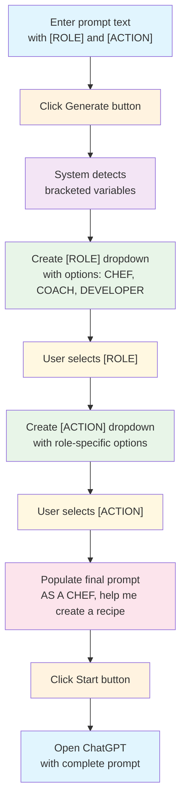

# Prompt Manager
> "Prompt Manager  
>  Store, Reuse, and Improve Your Prompts"

## Overall Description

A Python tool for managing AI/LLM prompts with CLI, web, and API interfaces. Stores prompts in JSON with GUID tracking, supports categories and search, and includes a template builder for dynamic prompts. Built for developers and AI practitioners who need to organize their prompt libraries.

## Why Use This?

**The Problem**: Managing prompts for AI interactions is messy. You have prompts scattered across files, notebooks, and chat histories. Finding the right prompt takes forever, and you keep recreating similar ones. 

**The Solution**: Prompt Manager gives you a central hub for all your prompts. 


## Features

**Core Management**
- Category organization for logical grouping
- Advanced search across names and content
- Version tracking with creation and modification timestamps

**Template System**
- Dynamic prompt templates with variable slots
- Context-aware prompt building
- **Cascading Combo Box System** - Hierarchical relationship management
- **State Persistence** - Remember and restore selections across sessions
- **Data-Driven Relationships** - Dynamic loading of relationship configurations

**Multiple Interfaces**
- Command-line interface for quick operations
- Web interface with modern Bootstrap UI
- REST API for programmatic access
- Real-time search with instant results

**AI Integration**
- Add API keys and store them safely
- You can configure a variety of LLMs, local and remote to use
- Chat interface for prompt testing and usage


## User Interfaces

## Template System

## Installation and Setup

## Usage Examples

**Template Builder Flow**

```
┌─────────────────────────────────────────────────────────────────┐
│                    USER INTERACTION FLOW                       │
├─────────────────────────────────────────────────────────────────┤
│                                                               │
│  STEP 1: Enter prompt text with bracketed variables          │
│  ┌─────────────────────────────────────────────────────────────┐ │
│  │ TEXT FIELD: "AS A [ROLE], help me [ACTION]"               │ │
│  └─────────────────────────────────────────────────────────────┘ │
│                                                               │
│  STEP 2: Generate button detects [ROLE] and [ACTION]         │
│  ┌─────────────────┐                                         │
│  │   GENERATE      │                                         │
│  └─────────────────┘                                         │
│                                                               │
│  STEP 3: System creates dropdown for [ROLE]                  │
│  ┌─────────────────────────────────────────────────────────────┐ │
│  │ [ROLE]: [Dropdown ▼]  Options: CHEF, COACH, DEVELOPER    │ │
│  └─────────────────────────────────────────────────────────────┘ │
│                                                               │
│  STEP 4: System creates dropdown for [ACTION]                │
│  ┌─────────────────────────────────────────────────────────────┐ │
│  │ [ACTION]: [Dropdown ▼]  (Options change based on [ROLE])  │ │
│  └─────────────────────────────────────────────────────────────┘ │
│                                                               │
│  STEP 5: User selects values, prompt gets populated          │
│  ┌─────────────────────────────────────────────────────────────┐ │
│  │ "AS A CHEF, help me create a recipe" (final prompt)      │ │
│  └─────────────────────────────────────────────────────────────┘ │
│                                                               │
│  STEP 6: Start button opens ChatGPT with complete prompt     │
│  ┌─────────────────┐    ┌─────────────────────────────────────┐ │
│  │     START       │───▶│ OPENS CHATGPT WITH FINAL PROMPT    │ │
│  └─────────────────┘    └─────────────────────────────────────┘ │
│                                                               │
└─────────────────────────────────────────────────────────────────┘
```

This example shows how the template system automatically detects bracketed variables like `[ROLE]` and `[ACTION]` and creates interactive dropdowns for building dynamic prompts.

**Mermaid Flow Diagram**



## Recent Achievements - Cascading Combo Box System

**✅ Phase 1 & 2 Complete: Production-Ready Cascading Combo Box Component**

We have successfully developed and tested a comprehensive cascading combo box system with the following features:

### **Core Functionality**
- **Hierarchical Relationships**: Role → What → Why cascading selections
- **State Persistence**: Remember and restore selections across role switches
- **Event-Driven Architecture**: Real-time updates based on user selections
- **Custom Combo Box Component**: Production-ready with dropdown behavior

### **Advanced Features**
- **Data-Driven Loading**: Dynamic relationship configuration from JSON
- **Error Handling**: Robust handling of invalid selections and edge cases
- **Performance Testing**: Scalable to large datasets (50+ roles, 10+ options each)
- **Visual Indicators**: Clear relationship flow with arrows and styling

### **Test-Driven Development**
- **8 Comprehensive Tests**: Each test validates specific behavior
- **Expressive Test Names**: Clear, descriptive test function names
- **One-Test-at-a-Time**: Incremental development with continuous green bar
- **Production Integration**: Testing with actual custom combo box component

### **Technical Implementation**
- **State Management**: Sophisticated state tracking for each relationship path
- **Cascade Reset**: Automatic clearing of downstream selections when parent changes
- **Event Coordination**: Complex event handling with proper timing and validation
- **Memory Management**: Efficient handling of large relationship datasets

### **Video Content Ready**
The development process has been documented for video walkthrough, showcasing:
- Test-driven development methodology
- Emergent design patterns
- Performance optimization techniques
- Production-ready component architecture

## Future Enhancements
