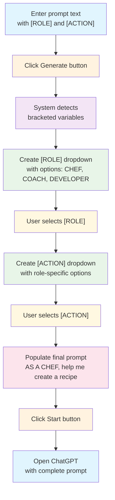

# Prompt Manager
> "Prompt Manager  
>  Store, Reuse, and Improve Your Prompts"

## Overall Description

A Python tool for managing AI/LLM prompts with CLI, web, and API interfaces. Stores prompts in JSON with GUID tracking, supports categories and search, and includes a template builder for dynamic prompts. Built for developers and AI practitioners who need to organize their prompt libraries.

## Why Use This?

**The Problem**: Managing prompts for AI interactions is messy. You have prompts scattered across files, notebooks, and chat histories. Finding the right prompt takes forever, and you keep recreating similar ones. 

**The Solution**: Prompt Manager gives you a central hub for all your prompts. 


## Features

**Core Management**
- Category organization for logical grouping
- Advanced search across names and content
- Version tracking with creation and modification timestamps

**Template System**
- Dynamic prompt templates with variable slots
- Context-aware prompt building

**Multiple Interfaces**
- Command-line interface for quick operations
- Web interface with modern Bootstrap UI
- REST API for programmatic access
- Real-time search with instant results

**AI Integration**
- Add API keys and store them safely
- You can configure a variety of LLMs, local and remote to use
- Chat interface for prompt testing and usage


## User Interfaces

## Template System

## Installation and Setup

## Usage Examples

**Template Builder Flow**

```
┌─────────────────────────────────────────────────────────────────┐
│                    USER INTERACTION FLOW                       │
├─────────────────────────────────────────────────────────────────┤
│                                                               │
│  STEP 1: Enter prompt text with bracketed variables          │
│  ┌─────────────────────────────────────────────────────────────┐ │
│  │ TEXT FIELD: "AS A [ROLE], help me [ACTION]"               │ │
│  └─────────────────────────────────────────────────────────────┘ │
│                                                               │
│  STEP 2: Generate button detects [ROLE] and [ACTION]         │
│  ┌─────────────────┐                                         │
│  │   GENERATE      │                                         │
│  └─────────────────┘                                         │
│                                                               │
│  STEP 3: System creates dropdown for [ROLE]                  │
│  ┌─────────────────────────────────────────────────────────────┐ │
│  │ [ROLE]: [Dropdown ▼]  Options: CHEF, COACH, DEVELOPER    │ │
│  └─────────────────────────────────────────────────────────────┘ │
│                                                               │
│  STEP 4: System creates dropdown for [ACTION]                │
│  ┌─────────────────────────────────────────────────────────────┐ │
│  │ [ACTION]: [Dropdown ▼]  (Options change based on [ROLE])  │ │
│  └─────────────────────────────────────────────────────────────┘ │
│                                                               │
│  STEP 5: User selects values, prompt gets populated          │
│  ┌─────────────────────────────────────────────────────────────┐ │
│  │ "AS A CHEF, help me create a recipe" (final prompt)      │ │
│  └─────────────────────────────────────────────────────────────┘ │
│                                                               │
│  STEP 6: Start button opens ChatGPT with complete prompt     │
│  ┌─────────────────┐    ┌─────────────────────────────────────┐ │
│  │     START       │───▶│ OPENS CHATGPT WITH FINAL PROMPT    │ │
│  └─────────────────┘    └─────────────────────────────────────┘ │
│                                                               │
└─────────────────────────────────────────────────────────────────┘
```

This example shows how the template system automatically detects bracketed variables like `[ROLE]` and `[ACTION]` and creates interactive dropdowns for building dynamic prompts.

**Mermaid Flow Diagram**


```mermaid
flowchart TD
    A[Enter prompt text<br/>with &lbrack;ROLE&rbrack; and &lbrack;ACTION&rbrack;] --> B[Click Generate button]
    B --> C[System detects<br/>bracketed variables]
    C --> D[Create &lbrack;ROLE&rbrack; dropdown<br/>with options: CHEF, COACH, DEVELOPER]
    D --> E[User selects &lbrack;ROLE&rbrack;]
    E --> F[Create &lbrack;ACTION&rbrack; dropdown<br/>with role-specific options]
    F --> G[User selects &lbrack;ACTION&rbrack;]
    G --> H[Populate final prompt<br/>AS A CHEF, help me create a recipe]
    H --> I[Click Start button]
    I --> J[Open ChatGPT<br/>with complete prompt]
    
    style A fill:#e1f5fe
    style B fill:#fff3e0
    style C fill:#f3e5f5
    style D fill:#e8f5e8
    style E fill:#fff8e1
    style F fill:#e8f5e8
    style G fill:#fff8e1
    style H fill:#fce4ec
    style I fill:#fff3e0
    style J fill:#e1f5fe
```

## Future Enhancements
